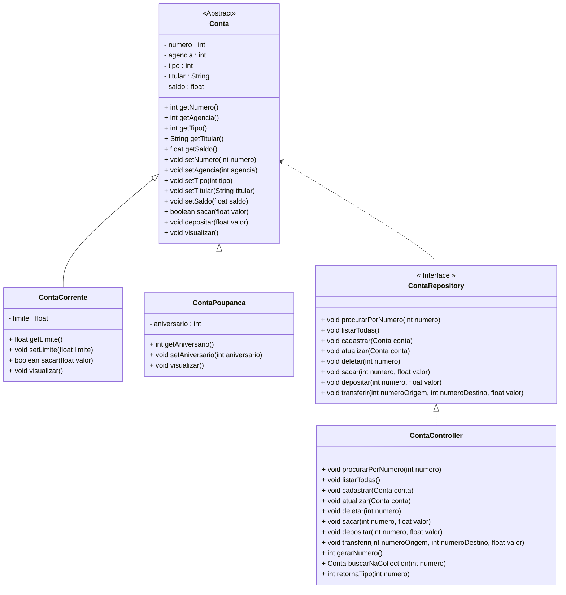

# Projeto Conta Bancária

<h2>1. O Projeto Conta Bancária</h2>

Diagrama de Classes do Projeto Conta Bancária completo na figura abaixo:



<br />

O Projeto será composto pelas seguintes Classes e Interfaces:

| Classe/Interface    | Descrição                                                    |
| ------------------- | ------------------------------------------------------------ |
| **Menu**            | Classe principal, que conterá o Método main, responsável por criar o Menu inicial da aplicação com todas as funcionalidades do sistema. |
| **Cores**           | Classe utilitária, que possui a função de aplicar cores ao Menu. |
| **Conta**           | Classe responsável por definir o Objeto Conta genérico.      |
| **ContaCorrente**   | Classe responsável por definir o Objeto Conta Corrente.      |
| **ContaPoupanca**   | Classe responsável por definir o Objeto Conta Poupanca.      |
| **ContaRepository** | Interface responsável por encapsular os Métodos que serão utilizados no Menu da aplicação |
| **ContaController** | Classe responsável por implementar a Interface ContaRepository. |


<h2>2. Como executar o Projeto Conta Bancária</h2>

### Pré-requisitos

Certifique-se de que você tenha o seguinte instalado em seu sistema:

       [Spring Tool Suite 4]
***
<h3>👣 Passo 1: Clonar o Repositório</h3>

Abra um terminal ou prompt de comando. <br/>
Navegue até o diretório onde você deseja clonar o repositório. <br/>
Execute o seguinte comando para clonar o repositório:

```
git clone https://github.com/RitaAlmeidah/ContaBancaria.git
```

Aguarde até que o processo de clonagem seja concluído.

***
<h3>👣  Passo 2: Entrar na Pasta do Projeto</h3>

Após a conclusão da clonagem, abra o arquivo no Spring Tool Suite 4.

***
<h3>👣 Passo 3: Executar o Projeto</h3>

Para executarmos o Projeto, clique no botão **Run**, na **Barra de Ferramentas**

***
## Autora:

- Rita Almeida(https://github.com/RitaAlmeidah))


